# Data Flow Diagram

**Generated:** 2025-07-15 10:17:33 UTC

```mermaid
sequenceDiagram
    participant U as 👥 User
    participant ALB as 🔄 Load Balancer
    participant OMS as 📊 OMS Service
    participant User as 👤 User Service
    participant Audit as 📋 Audit Service
    participant Data as ⚙️ Data Kernel
    participant DB as 🗄️ Database
    participant Cache as ⚡ Redis
    participant NATS as 📨 NATS
    participant Monitor as 📊 Monitoring
    
    %% Authentication Flow
    U->>+ALB: 1. HTTPS Request
    ALB->>+OMS: 2. Route to Service
    OMS->>+User: 3. Validate Token
    User->>+DB: 4. User Lookup
    DB-->>-User: 5. User Data
    User-->>-OMS: 6. Auth Result
    
    %% Business Logic Flow
    OMS->>+Cache: 7. Check Cache
    Cache-->>-OMS: 8. Cache Hit/Miss
    
    alt Cache Miss
        OMS->>+DB: 9. Database Query
        DB-->>-OMS: 10. Data Response
        OMS->>Cache: 11. Update Cache
    end
    
    %% Audit Logging
    OMS->>+Audit: 12. Log Request
    Audit->>+DB: 13. Store Audit
    DB-->>-Audit: 14. Confirm
    Audit-->>-OMS: 15. Logged
    
    %% Event Publishing
    OMS->>+NATS: 16. Publish Event
    NATS->>+Data: 17. Event Delivery
    Data->>+DB: 18. Process Data
    DB-->>-Data: 19. Result
    Data-->>-NATS: 20. Ack
    NATS-->>-OMS: 21. Published
    
    %% Response
    OMS-->>-ALB: 22. Response
    ALB-->>-U: 23. HTTPS Response
    
    %% Monitoring
    Note over OMS,Monitor: Continuous Monitoring
    OMS->>Monitor: Metrics & Traces
    User->>Monitor: Metrics & Traces
    Audit->>Monitor: Metrics & Traces
    Data->>Monitor: Metrics & Traces
```

## Usage

This Mermaid diagram can be:
1. **Rendered in GitHub** - Automatically displayed in GitHub README files
2. **Used in Documentation** - Embedded in GitBook, Notion, or other docs
3. **Exported to Images** - Using Mermaid CLI or online tools
4. **Integrated in Presentations** - Copy the Mermaid code into presentation tools

## Live Editor

Edit this diagram at: [Mermaid Live Editor](https://mermaid.live/)

## Integration

This diagram is automatically updated when:
- Code changes are committed to the repository
- Infrastructure configuration is modified
- GitHub Actions workflows are triggered
