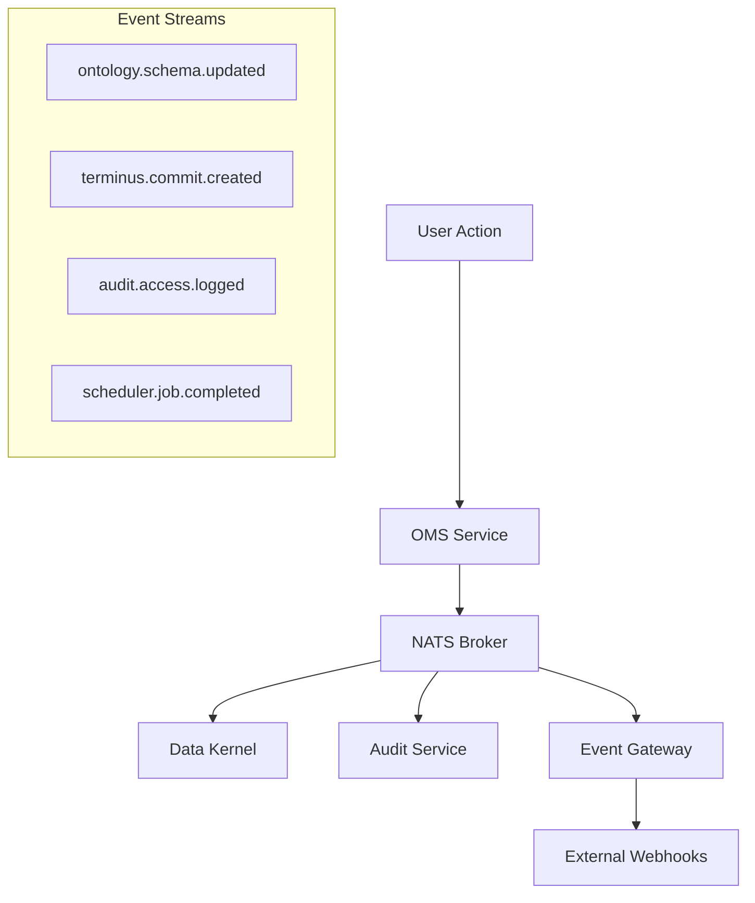

# Arrakis Platform Event Architecture

Welcome to the Arrakis Platform Event Catalog! This documentation provides comprehensive information about our event-driven architecture, messaging patterns, and async communication flows.

## 🏗️ Architecture Overview

The Arrakis platform uses **NATS** as the primary message broker for async communication between microservices. Our event architecture follows CloudEvents specification and implements several key patterns:

- **Event Sourcing** - Domain events capture state changes
- **Pub/Sub Messaging** - Loose coupling between services  
- **Event Streaming** - Real-time data flows
- **Webhook Integration** - External system notifications

## 📡 Message Broker

- **Technology**: NATS 2.10+
- **URL**: `nats://nats:4222`
- **Monitoring**: Integrated with Prometheus & Grafana
- **Clustering**: Configured for high availability

## 🎯 Core Event Streams

### Data Processing Events
- **Stream**: `terminus.commit.*`
- **Purpose**: TerminusDB data change notifications
- **Producer**: Data Kernel Service
- **Consumers**: OMS, Audit Service

### Audit Events  
- **Stream**: `audit.events.*`
- **Purpose**: Security and compliance tracking
- **Producer**: All services
- **Consumers**: Audit Service, External SIEM

### Job Management Events
- **Stream**: `scheduler.jobs.*` 
- **Purpose**: Job lifecycle and status updates
- **Producer**: Scheduler Service
- **Consumers**: OMS, Monitoring

### Ontology Events
- **Stream**: `ontology.*`
- **Purpose**: Schema and ontology change notifications
- **Producer**: OMS
- **Consumers**: Data Kernel, Embedding Service

## 🔄 Event Flow Patterns



## 📋 Event Standards

All events in the Arrakis platform follow these standards:

### CloudEvents Format
- **Specification**: CloudEvents 1.0
- **Content-Type**: `application/cloudevents+json`
- **Required Attributes**: type, source, subject, time, datacontenttype

### Naming Conventions
- **Pattern**: `domain.entity.action`
- **Examples**: 
  - `ontology.schema.created`
  - `terminus.document.updated`
  - `audit.user.authenticated`

### Event Versioning
- **Strategy**: Additive changes only
- **Versioning**: Semantic versioning in event type
- **Backward Compatibility**: Maintained for 2 major versions

## 🛠️ Development Guidelines

### Publishing Events
```python
# Example: Publishing an ontology event
event = {
    "type": "ontology.schema.created",
    "source": "oms",
    "subject": f"schema/{schema_id}",
    "data": {
        "schema_id": schema_id,
        "name": schema_name,
        "version": "1.0.0"
    }
}
await nats_client.publish("ontology.schema.created", event)
```

### Consuming Events
```python
# Example: Subscribing to events
async def handle_schema_event(msg):
    event = json.loads(msg.data)
    schema_id = event["data"]["schema_id"]
    # Process the event
    
await nats_client.subscribe("ontology.schema.*", handle_schema_event)
```

## 📊 Monitoring & Observability

- **Metrics**: Prometheus metrics for event throughput and latency
- **Tracing**: Jaeger integration for event flow tracking
- **Logging**: Structured logging with correlation IDs
- **Dashboards**: Grafana dashboards for event monitoring

## 🔗 Related Documentation

- [Service Catalog](../catalog-info.yaml) - Service definitions and dependencies
- [API Documentation](../build/index.html) - REST and GraphQL APIs
- [Architecture Diagrams](../diagrams/) - System architecture visualization
- [Monitoring Setup](../monitoring/) - Observability configuration

## 🎮 Interactive Features

This Event Catalog provides:

- **Event Browser** - Explore all events and their schemas
- **Service Map** - Visual representation of event flows
- **Schema Registry** - Event schema definitions and validation
- **Event Simulator** - Test event flows in development
- **Dependency Graph** - Understand service relationships through events