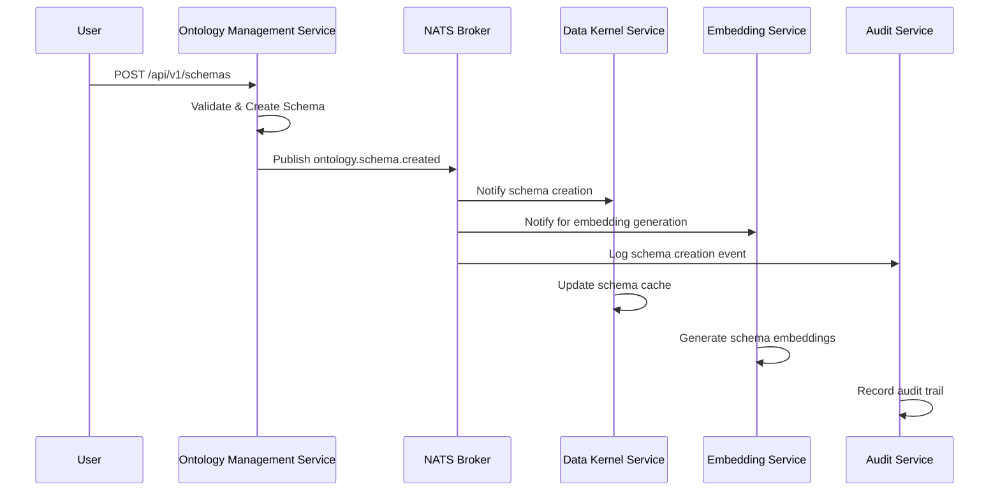

# Ontology Schema Created Event

This event is published whenever a new ontology schema is successfully created in the Arrakis platform. It serves as the primary notification mechanism for schema lifecycle management.

## Event Details

- **Event Type**: `ontology.schema.created`
- **Source**: `ontology-management-service`
- **Subject Pattern**: `schema/{schema_id}`
- **Content Type**: `application/cloudevents+json`

## Event Flow



## Event Schema

```json
{
  "type": "object",
  "properties": {
    "specversion": {
      "type": "string",
      "const": "1.0"
    },
    "type": {
      "type": "string",
      "const": "ontology.schema.created"
    },
    "source": {
      "type": "string",
      "const": "ontology-management-service"
    },
    "subject": {
      "type": "string",
      "pattern": "^schema/[a-zA-Z0-9_-]+$"
    },
    "id": {
      "type": "string",
      "format": "uuid"
    },
    "time": {
      "type": "string",
      "format": "date-time"
    },
    "datacontenttype": {
      "type": "string",
      "const": "application/json"
    },
    "data": {
      "type": "object",
      "properties": {
        "schema_id": {
          "type": "string",
          "description": "Unique identifier for the schema"
        },
        "name": {
          "type": "string",
          "description": "Human-readable schema name"
        },
        "version": {
          "type": "string",
          "description": "Schema version following semantic versioning"
        },
        "description": {
          "type": "string",
          "description": "Optional schema description"
        },
        "namespace": {
          "type": "string",
          "description": "Schema namespace for organization"
        },
        "created_by": {
          "type": "string",
          "description": "User ID who created the schema"
        },
        "metadata": {
          "type": "object",
          "description": "Additional schema metadata",
          "properties": {
            "tags": {
              "type": "array",
              "items": { "type": "string" }
            },
            "category": {
              "type": "string"
            }
          }
        }
      },
      "required": ["schema_id", "name", "version", "created_by"]
    }
  },
  "required": ["specversion", "type", "source", "subject", "id", "time", "data"]
}
```

## Example Event

```json
{
  "specversion": "1.0",
  "type": "ontology.schema.created",
  "source": "ontology-management-service",
  "subject": "schema/user-profile-v1",
  "id": "550e8400-e29b-41d4-a716-446655440000",
  "time": "2024-01-15T10:30:00Z",
  "datacontenttype": "application/json",
  "data": {
    "schema_id": "user-profile-v1",
    "name": "User Profile Schema",
    "version": "1.0.0",
    "description": "Schema defining user profile structure and validation rules",
    "namespace": "identity",
    "created_by": "user123",
    "metadata": {
      "tags": ["user", "profile", "identity"],
      "category": "core"
    }
  }
}
```

## Processing Guidelines

### For Data Kernel Service
1. **Cache Update**: Add new schema to the schema cache
2. **Validation Setup**: Configure validation rules for the new schema
3. **Index Creation**: Create necessary database indexes

### For Embedding Service
1. **Schema Analysis**: Analyze schema structure for embedding generation
2. **Vector Creation**: Generate embeddings for schema elements
3. **Similarity Index**: Update schema similarity indexes

### For Audit Service
1. **Event Logging**: Record schema creation in audit trail
2. **Compliance Check**: Verify schema meets compliance requirements
3. **Access Control**: Set up initial access permissions

## Error Handling

If event processing fails, services should:

1. **Log the Error**: Include event ID and failure reason
2. **Dead Letter Queue**: Send failed events to DLQ for retry
3. **Alerting**: Trigger appropriate alerts for monitoring team
4. **Compensation**: Implement compensation logic if needed

## Monitoring

Key metrics to track:
- Event publication rate
- Processing latency per consumer
- Error rate and types
- Schema creation volume trends

## Related Events

- [`ontology.schema.updated`](../ontology-schema-updated/) - Schema modification events
- [`ontology.schema.deleted`](../ontology-schema-deleted/) - Schema deletion events
- [`terminus.commit.created`](../terminus-commit-created/) - Related data changes
