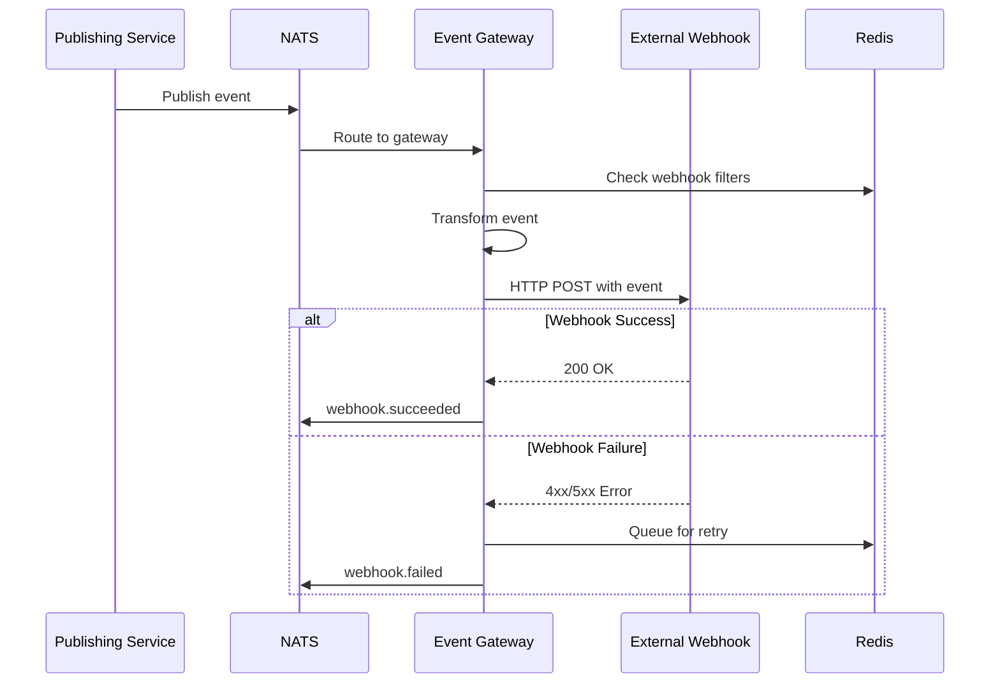
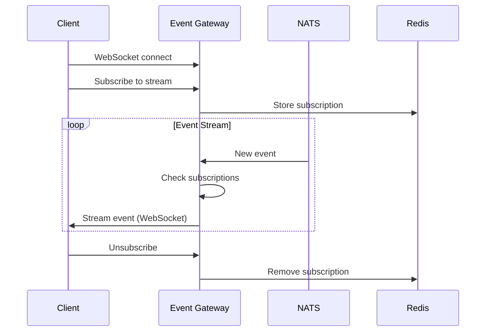

# Event Gateway Service

The Event Gateway service acts as the bridge between the internal Arrakis event system and external integrations. It provides webhook management, event transformation, and reliable delivery mechanisms for connecting with third-party systems.

## 🎯 Service Overview

- **Type**: Integration Gateway Service
- **Language**: Python 3.11+
- **Framework**: FastAPI + WebSocket support
- **Message Broker**: NATS (primary)
- **Storage**: Redis (webhook state, event cache)
- **Protocols**: HTTP, WebSocket, CloudEvents

## 📡 Event Publishing

This service publishes the following events:

### Webhook Events
- [`webhook.registered`](../../events/webhook-registered/) - New webhook registration
- [`webhook.triggered`](../../events/webhook-triggered/) - Webhook execution attempt
- [`webhook.failed`](../../events/webhook-failed/) - Webhook delivery failure
- [`webhook.succeeded`](../../events/webhook-succeeded/) - Successful webhook delivery

### Stream Management Events
- [`stream.created`](../../events/stream-created/) - New event stream creation
- [`stream.subscribed`](../../events/stream-subscribed/) - New stream subscription
- [`stream.unsubscribed`](../../events/stream-unsubscribed/) - Stream unsubscription

### Gateway Health Events
- [`gateway.health.degraded`](../../events/gateway-health-degraded/) - Service performance issues
- [`gateway.health.recovered`](../../events/gateway-health-recovered/) - Service recovery

## 📥 Event Consumption

This service consumes **ALL** events from other services and routes them based on configured rules:

### Core Domain Events
- [`ontology.schema.*`](../../events/ontology-schema-created/) - Schema lifecycle events
- [`terminus.commit.*`](../../events/terminus-commit-created/) - Data change events
- [`audit.events.*`](../../events/audit-events/) - Audit and compliance events
- [`scheduler.job.*`](../../events/scheduler-job-completed/) - Job lifecycle events

### Processing Pattern
```python
async def handle_all_events(event: CloudEvent):
    """Route all events through the gateway"""
    
    # 1. Event validation and enrichment
    validated_event = await validate_and_enrich(event)
    
    # 2. Find matching webhooks
    webhooks = await find_matching_webhooks(validated_event)
    
    # 3. Transform event for each webhook
    for webhook in webhooks:
        transformed_event = await transform_event(validated_event, webhook)
        await deliver_webhook(webhook, transformed_event)
    
    # 4. Stream to real-time subscribers
    await stream_to_subscribers(validated_event)
```

## 🔄 Event Flow Patterns

### Webhook Delivery Flow


### Real-time Streaming Flow


## 🛠️ Event Routing Configuration

### Webhook Filters
```yaml
webhooks:
  external_crm:
    url: "https://crm.company.com/webhooks/arrakis"
    events:
      - "ontology.schema.created"
      - "ontology.schema.updated"
    filters:
      - field: "data.namespace"
        operator: "equals"
        value: "customer"
    
  analytics_platform:
    url: "https://analytics.company.com/events"
    events:
      - "terminus.commit.*"
    transformation: "analytics_format"
    retry_policy:
      max_attempts: 5
      backoff: "exponential"

  security_siem:
    url: "https://siem.company.com/api/events"
    events:
      - "audit.events.*"
      - "user.authenticated"
      - "ontology.violation.*"
    security:
      auth_type: "bearer_token"
      secret_name: "siem_token"
```

### Stream Definitions
```yaml
streams:
  real_time_schema_changes:
    subjects:
      - "ontology.schema.*"
    retention: "7d"
    max_messages: 1000000
    
  data_processing_events:
    subjects:
      - "terminus.commit.*"
      - "scheduler.job.*"
    retention: "30d"
    max_messages: 10000000
    
  audit_stream:
    subjects:
      - "audit.events.*"
    retention: "2y"
    max_messages: 100000000
    compliance: true
```

## 🔧 Event Transformation

### CloudEvents to Webhook Format
```python
async def transform_for_webhook(event: CloudEvent, webhook_config: dict) -> dict:
    """Transform CloudEvent to webhook-specific format"""
    
    transformation_type = webhook_config.get('transformation', 'standard')
    
    transformations = {
        'standard': transform_standard,
        'analytics_format': transform_analytics,
        'crm_format': transform_crm,
        'siem_format': transform_siem
    }
    
    transformer = transformations.get(transformation_type, transform_standard)
    return await transformer(event, webhook_config)

async def transform_analytics(event: CloudEvent, config: dict) -> dict:
    """Transform for analytics platform"""
    return {
        'timestamp': event.get_time(),
        'event_type': event.get_type(),
        'source_service': event.get_source(),
        'payload': event.data,
        'metadata': {
            'platform': 'arrakis',
            'version': '2.0.0',
            'correlation_id': event.get_id()
        }
    }
```

### Event Enrichment
```python
async def enrich_event(event: CloudEvent) -> CloudEvent:
    """Add additional context to events"""
    
    enriched_data = {
        **event.data,
        'enrichment': {
            'processed_at': datetime.utcnow().isoformat(),
            'gateway_version': '1.0.0',
            'correlation_chain': await build_correlation_chain(event),
            'related_events': await find_related_events(event)
        }
    }
    
    return CloudEvent({
        **event.get_attributes(),
        'data': enriched_data
    })
```

## 📊 Delivery Guarantees

### Retry Logic
- **Exponential Backoff**: 1s, 2s, 4s, 8s, 16s
- **Max Attempts**: Configurable per webhook (default: 3)
- **Dead Letter Queue**: Failed events after max retries
- **Circuit Breaker**: Prevent cascading failures

### Delivery Tracking
```python
class DeliveryStatus:
    PENDING = "pending"
    IN_PROGRESS = "in_progress"
    SUCCEEDED = "succeeded"
    FAILED = "failed"
    RETRYING = "retrying"
    DEAD_LETTER = "dead_letter"

async def track_delivery(webhook_id: str, event_id: str, status: str):
    """Track webhook delivery status"""
    await redis.hset(
        f"delivery:{webhook_id}:{event_id}",
        mapping={
            'status': status,
            'timestamp': datetime.utcnow().isoformat(),
            'attempts': attempts,
            'last_error': last_error
        }
    )
```

## 🔐 Security Features

### Authentication Methods
- **API Keys**: Simple token-based auth
- **Bearer Tokens**: OAuth 2.0 / JWT tokens  
- **HMAC Signatures**: Request signing with shared secrets
- **mTLS**: Mutual TLS certificate authentication

### Event Filtering
- **Namespace Filtering**: Route events by data namespace
- **Content Filtering**: Filter based on event payload
- **Source Filtering**: Filter by event source service
- **Custom Rules**: Complex filtering with expressions

## 📈 Monitoring & Metrics

### Key Metrics
- **Event Throughput**: Events/second through gateway
- **Webhook Success Rate**: Successful deliveries / total attempts
- **Delivery Latency**: Time from event receipt to webhook delivery
- **Error Rates**: Failed deliveries by webhook and error type

### Dashboards
- **Event Flow Dashboard** - Real-time event routing metrics
- **Webhook Health Dashboard** - Webhook delivery success rates
- **Integration Status Dashboard** - External system connectivity

### Alerts
- **High Error Rate** - >5% webhook delivery failures
- **Delivery Lag** - >30 seconds delivery latency
- **Webhook Down** - External webhook consistently failing
- **Circuit Breaker Open** - Circuit breaker protecting external system

## 🚨 Error Handling

### Webhook Failures
```python
async def handle_webhook_failure(webhook: Webhook, event: CloudEvent, error: Exception):
    """Handle webhook delivery failures"""
    
    failure_event = CloudEvent({
        'type': 'webhook.failed',
        'source': 'event-gateway',
        'subject': f'webhook/{webhook.id}',
        'data': {
            'webhook_id': webhook.id,
            'event_id': event.get_id(),
            'error_type': type(error).__name__,
            'error_message': str(error),
            'retry_count': await get_retry_count(webhook.id, event.get_id())
        }
    })
    
    await publish_event(failure_event)
    
    # Queue for retry if attempts remaining
    if should_retry(webhook, error):
        await queue_for_retry(webhook, event)
    else:
        await send_to_dead_letter_queue(webhook, event)
```

## 🔗 Related Services

- **[NATS Message Broker](../nats/)** - Core event streaming infrastructure
- **[Ontology Management Service](../ontology-management-service/)** - Primary event producer
- **[Data Kernel Service](../data-kernel-service/)** - High-volume event producer
- **[Audit Service](../audit-service/)** - Compliance event producer