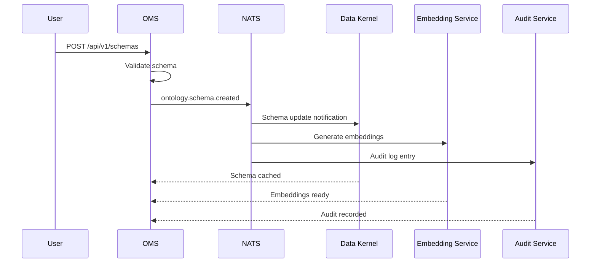
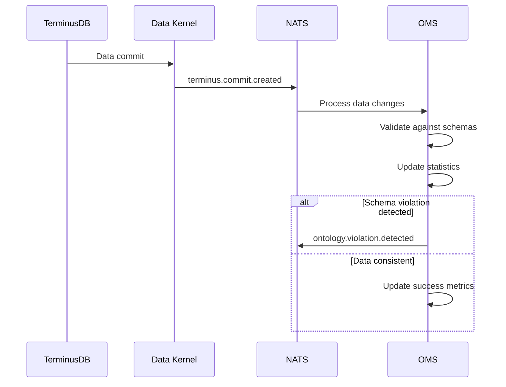

# Ontology Management Service (OMS)

The Ontology Management Service is the central component of the Arrakis platform responsible for managing ontologies, schemas, and data models. It provides comprehensive APIs for schema lifecycle management and serves as the authoritative source for data structure definitions.

## 🎯 Service Overview

- **Type**: Core Domain Service
- **Language**: Python 3.11+
- **Framework**: FastAPI
- **Database**: TerminusDB (primary), PostgreSQL (metadata)
- **Cache**: Redis
- **Messaging**: NATS

## 📡 Event Publishing

This service publishes the following events:

### Schema Lifecycle Events
- [`ontology.schema.created`](../../events/ontology-schema-created/) - New schema creation
- [`ontology.schema.updated`](../../events/ontology-schema-updated/) - Schema modifications  
- [`ontology.schema.deleted`](../../events/ontology-schema-deleted/) - Schema removal
- [`ontology.schema.validated`](../../events/ontology-schema-validated/) - Schema validation results

### Data Model Events
- [`ontology.model.created`](../../events/ontology-model-created/) - New data model
- [`ontology.model.updated`](../../events/ontology-model-updated/) - Model changes
- [`ontology.branch.created`](../../events/ontology-branch-created/) - New branch creation
- [`ontology.branch.merged`](../../events/ontology-branch-merged/) - Branch merge operations

## 📥 Event Consumption

This service consumes the following events:

### Data Change Events
- [`terminus.commit.created`](../../events/terminus-commit-created/) - Data changes in TerminusDB
  - **Purpose**: Update schema statistics and validate data consistency
  - **Handler**: `handle_terminus_commit`
  - **Processing**: Asynchronous with retry logic

### User Management Events  
- [`user.authenticated`](../../events/user-authenticated/) - User authentication
  - **Purpose**: Track schema access and usage patterns
  - **Handler**: `handle_user_auth`
  - **Processing**: Fire-and-forget logging

### Job Completion Events
- [`scheduler.job.completed`](../../events/scheduler-job-completed/) - Background job results
  - **Purpose**: Process schema validation and migration results
  - **Handler**: `handle_job_completion`
  - **Processing**: Synchronous with error handling

## 🔄 Event Flow Patterns

### Schema Creation Flow


### Data Consistency Flow


## 🛠️ Event Handlers

### Schema Event Handler
```python
async def handle_schema_events(event: CloudEvent):
    """Handle incoming schema-related events"""
    event_type = event.get_type()
    
    handlers = {
        'terminus.commit.created': handle_terminus_commit,
        'user.authenticated': handle_user_auth,
        'scheduler.job.completed': handle_job_completion
    }
    
    handler = handlers.get(event_type)
    if handler:
        await handler(event)
    else:
        logger.warning(f"No handler for event type: {event_type}")

async def handle_terminus_commit(event: CloudEvent):
    """Process TerminusDB commit events"""
    commit_data = event.data
    database_id = commit_data['database_id']
    
    # Update schema statistics
    await update_schema_stats(database_id, commit_data['changes'])
    
    # Validate data consistency
    violations = await validate_data_consistency(commit_data)
    if violations:
        await publish_violation_event(violations)
```

### Event Publishing
```python
async def publish_schema_event(schema_id: str, event_type: str, data: dict):
    """Publish schema lifecycle events"""
    
    event = CloudEvent({
        'type': f'ontology.schema.{event_type}',
        'source': 'ontology-management-service',
        'subject': f'schema/{schema_id}',
        'data': data
    })
    
    await nats_client.publish(event.get_type(), event)
```

## 📊 Event Metrics

### Published Events
- **ontology.schema.*** - Schema lifecycle events
- **ontology.model.*** - Data model events  
- **ontology.branch.*** - Branch management events
- **ontology.violation.*** - Data consistency violations

### Consumed Events
- **terminus.commit.*** - Data change notifications
- **user.*** - User management events
- **scheduler.job.*** - Background job events

### Performance Metrics
- Event publication rate: ~50-100 events/minute
- Event processing latency: <100ms p95
- Error rate: <0.1%
- Retry rate: <5%

## 🔧 Configuration

### NATS Configuration
```yaml
nats:
  url: "nats://nats:4222"
  subjects:
    publish:
      - "ontology.*"
    subscribe:
      - "terminus.commit.*"
      - "user.authenticated"
      - "scheduler.job.completed"
  
  retry_policy:
    max_attempts: 3
    backoff: "exponential"
    initial_delay: "1s"
    max_delay: "30s"
```

### Event Routing
```yaml
event_routing:
  schema_events:
    - "ontology.schema.*"
  model_events:
    - "ontology.model.*"
  branch_events:
    - "ontology.branch.*"
  
  filters:
    critical_schemas:
      - "core.*"
      - "security.*"
    public_events:
      - "ontology.schema.created"
      - "ontology.schema.updated"
```

## 🚨 Error Handling

### Event Processing Errors
- **Dead Letter Queue**: Failed events sent to `ontology.errors` subject
- **Retry Logic**: Exponential backoff with max 3 attempts
- **Circuit Breaker**: Prevent cascade failures
- **Alerting**: PagerDuty integration for critical failures

### Data Consistency Errors
- **Validation Failures**: Published as `ontology.violation.detected`
- **Schema Conflicts**: Automatic rollback and notification
- **Integrity Issues**: Manual intervention required

## 📈 Monitoring

### Dashboards
- **Event Flow Dashboard** - Real-time event processing metrics
- **Schema Health Dashboard** - Schema validation and consistency
- **Performance Dashboard** - Latency and throughput metrics

### Alerts
- **High Error Rate** - >1% event processing failures
- **Processing Lag** - >5 minutes behind real-time
- **Schema Violations** - Any data consistency violations
- **Service Unavailable** - Health check failures

## 🔗 Related Services

- **[Data Kernel Service](../data-kernel-service/)** - Primary event consumer
- **[Embedding Service](../embedding-service/)** - Schema embedding generation
- **[Audit Service](../audit-service/)** - Compliance and audit logging
- **[Event Gateway](../event-gateway/)** - External webhook routing